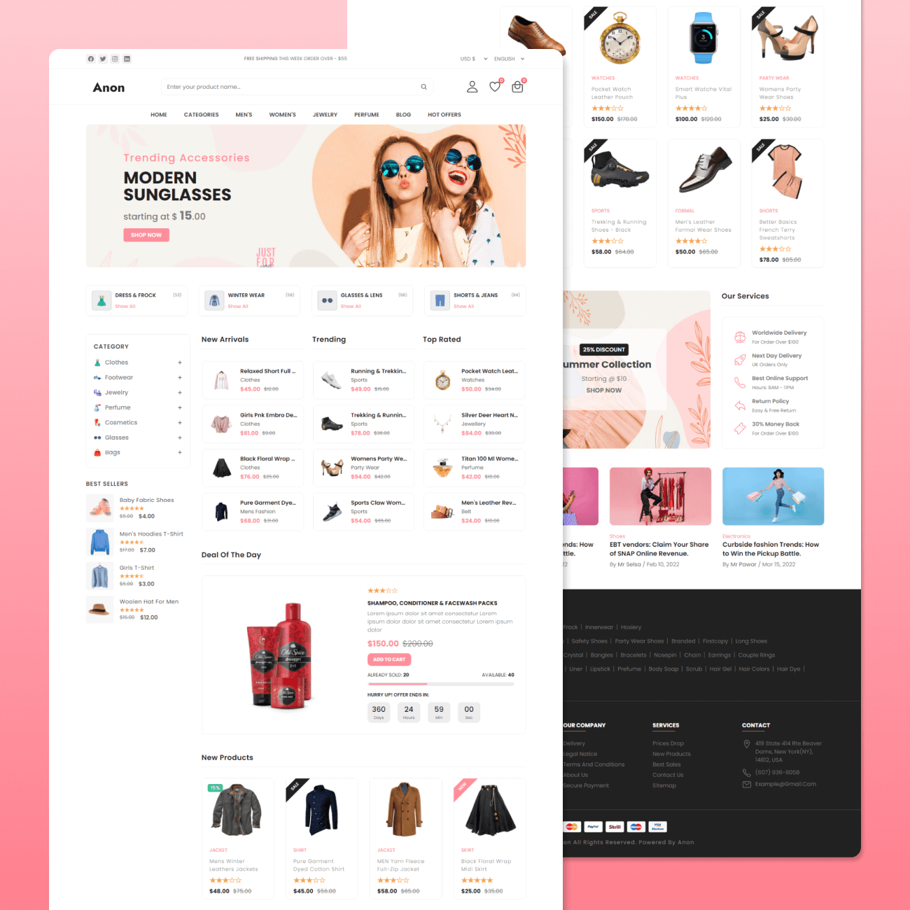

# 🛍️ VProd - Responsive eCommerce Website

<div align="center">


A modern, responsive eCommerce website built using **HTML5, CSS3, and JavaScript**.
This project demonstrates a clean UI, responsive layouts, interactive components, and an engaging shopping experience across desktop and mobile devices.

⭐ **If you like this project, don't forget to star the repository!**

</div>

---

## 📸 Preview

<div align="center">

### 💻 Desktop View



<br><br>

### 📱 Mobile View


</div>


---

## ✨ Features

* 🎨 Modern and Clean UI
* 📱 Fully Responsive Design
* 🛒 Product Listings
* 📂 Category Navigation
* 🔍 Search Bar
* 🎯 Deal of the Day Section
* ⭐ Trending & New Arrivals
* 💬 Customer Testimonials
* 📧 Newsletter Subscription
* 🔔 Notification Toast
* 📜 Responsive Navigation Menu
* 📦 Product Cards
* ⚡ Smooth Animations
* 🌐 Cross Browser Compatible

---

## 🛠️ Tech Stack

| Technology   | Usage                       |
| ------------ | --------------------------- |
| HTML5        | Website Structure           |
| CSS3         | Styling & Responsive Design |
| JavaScript   | Interactivity               |
| Ion Icons    | Icons                       |
| Google Fonts | Typography                  |

---

## 📂 Project Structure

```text
Ecommerce-website/
│
├── assets/
│   ├── css/
│   │   ├── style.css
│   │   └── style-prefix.css
│   │
│   ├── js/
│   │   └── script.js
│   │
│   ├── images/
│   └── logo/
│
├── website-demo-image/
│   ├── desktop.png
│   └── mobile.png
│
├── index.html
├── README.md
└── LICENSE
```

---

## 🚀 Getting Started

### Clone the Repository

```bash
git clone https://github.com/Parth-1506/Ecommerce-website.git
```

### Navigate to the Project

```bash
cd Ecommerce-website
```

### Run the Website

Simply open **index.html** in your browser.

Or run it using **VS Code Live Server**.

---

## 📱 Responsive Design

The website is optimized for:

* 💻 Desktop
* 💼 Laptop
* 📱 Tablet
* 📲 Mobile

---

## 🎯 Website Sections

* Header
* Hero Banner
* Categories
* Featured Products
* New Arrivals
* Trending Products
* Deal of the Day
* Testimonials
* Services
* Blog Section
* Newsletter
* Footer

---

## ⚙️ Interactive Features

* Responsive Navigation
* Mobile Menu
* Category Accordion
* Newsletter Popup
* Notification Toast
* Product Hover Effects
* Smooth UI Animations

---

## 📈 Future Enhancements

* 👤 User Authentication
* ❤️ Wishlist
* 🛒 Shopping Cart
* 🔎 Product Search & Filters
* 💳 Payment Gateway
* 📦 Order Tracking
* 🌙 Dark Mode
* 🗄️ Backend Integration
* 📊 Admin Dashboard

---

## 🤝 Contributing

Contributions are always welcome!

1. Fork the repository.
2. Create a new feature branch.

```bash
git checkout -b feature/NewFeature
```

3. Commit your changes.

```bash
git commit -m "Add new feature"
```

4. Push your branch.

```bash
git push origin feature/NewFeature
```

5. Open a Pull Request.

---

## 👨‍💻 Author

**Parth**

* GitHub: https://github.com/Parth-1506

---

## 📄 License

This project is licensed under the **MIT License**.

---

<div align="center">

### 🌟 If you found this project helpful, please consider giving it a star!

Made with ❤️ using **HTML, CSS & JavaScript**

</div>
